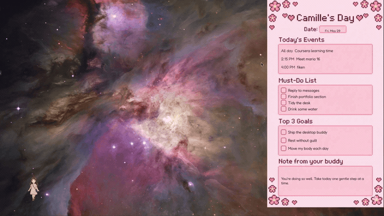

<p align="center">
  
</p>

<p align="center">
  
</p>

## 🌸 Hi there

**Desktop Buddy** is a tiny chibi-girl companion who lives on my desktop. She strolls along the bottom of the screen, waves hello, shows me what my day looks like, and gives me a gentle nudge before things start — all in a soft, kind-friend tone rather than a buzzing-notification one.

She started as a "wouldn't it be cute if…" idea and turned into a fun little playground for tinkering with desktop apps, voice, and calendar automation. 🐧

## ✨ What she does

- 🚶‍♀️ **Walks around your desktop** — a hand-illustrated character who paces along the screen and strikes friendly poses.
- 🎙️ **Talks to you** — soft spoken voice clips paired with gentle, encouraging little messages.
- 📅 **Knows your day** — reads your Google Calendar (read-only) to see what's coming up.
- 📌 **Daily post-it** — a cute planner panel that pops out of her with today's events and to-dos. You can **drag it anywhere** to keep it out of the way, and she remembers where you left it.
- 🌅 **Welcomes you back** — starts automatically when you log in and greets you with a warm hello.
- ⏰ **Gentle reminders** — gives you a heads-up about 15 minutes before each event, so nothing sneaks up on you.

## 🛠️ Built with

- **Python** + **PyQt6** — the character, animation, and transparent always-on-top overlay
- **Google Calendar API** — read-only access to today's events
- **pygame-ce** — voice and sound playback

Made for **Pop!_OS / COSMIC** on Linux (Wayland).

## 🚀 Try it

```bash
# 1. Set up a virtual environment and install dependencies
python3 -m venv .venv
.venv/bin/pip install -r requirements.txt

# 2. Add your own Google Calendar credentials.json (kept private, never committed)

# 3. Say hello
.venv/bin/python main.py
```

To have her greet you automatically at login, run `scripts/setup_autostart.sh`.

## ⌨️ Keyboard shortcuts

**Click the buddy first** so she has keyboard focus, then:

| Key | What it does |
| --- | --- |
| `Space` | Say something — a spontaneous little message, the same one the timer gives |
| `P` | Toggle the daily-summary post-it panel |
| `G` | Replay the welcome-back greeting (and panel) |
| `B` | Re-show today's morning brief — re-fetches live weather, without touching tomorrow's automatic one |
| `D` | Read today's important emails (read-only) and draft a reply for each to review |
| `R` | Preview an event reminder (bubble + post-it) without waiting for a real event |
| `W` | Reopen the weekly-plan panel, or minimize/restore it if it's already open |
| `Esc` | Close the buddy |

## 🗓️ Weekly content planner

She can also act as a gentle **content strategist**: she researches what's
current — recent AI/marketing-tech launches and the hook styles working right
now — and drafts a week of social content built around the Instagram grid
(Monday carousel, Wednesday reel, Friday post). She shows the week at a glance in
a small, draggable **desktop panel** (drag the header to move it, click the
header or press **W** to minimize/maximize), and writes the **full** detailed
plan — ideas with their "why", drafted copy, slide-by-slide breakdowns,
multi-platform fit notes, and GEO/SEO tips — to your **Notion** page, which the
panel links to.

The research is one small call to the **Anthropic API** (using its built-in web
search); the write-up uses the **Notion API**. Both are **bring-your-own-key**,
loaded from a gitignored `.env`:

```bash
# 1. Copy the template and add your own values (this .env is gitignored — never committed)
cp .env.example .env
#    then edit .env and set:
#      ANTHROPIC_API_KEY=sk-ant-...      (https://console.anthropic.com/ → API keys)
#      NOTION_TOKEN=ntn_...              (https://www.notion.so/my-integrations)
#      NOTION_PAGE_ID=...                (the page's 32-char id, from its URL)
#    then share that Notion page with your integration:
#      open the page → ••• → Connections → add your integration
```

```bash
# 2. Preview a free SAMPLE plan first — no API call, no Notion write, no cost.
#    This launches the buddy and pops the compact panel with sample data:
.venv/bin/python main.py --plan-week --mock

# 3. When the panel looks right, run ONE real test: research + write to Notion,
#    then check your Notion page to confirm it appears:
.venv/bin/python content_planner.py
```

You can also have her do the real run at launch with
`.venv/bin/python main.py --plan-week`.

> Your keys stay on your machine: they live only in your local `.env`
> (gitignored) and are never committed. If anything is missing she shows a
> friendly note instead of erroring, and your generated plan is kept local too.

## 🔤 Credits

Speech bubbles use [**Fredoka**](https://fonts.google.com/specimen/Fredoka) by Hanken Design Co., licensed under the [SIL Open Font License 1.1](https://openfontlicense.org/). The font and its license are bundled in [`assets/fonts/`](assets/fonts/).

## 👋 About

Made by [Camille](https://bycamillenicole.com) — a digital marketer who loves exploring new tech and building little tools and AI-assisted automations just for the fun of it. 🌸
